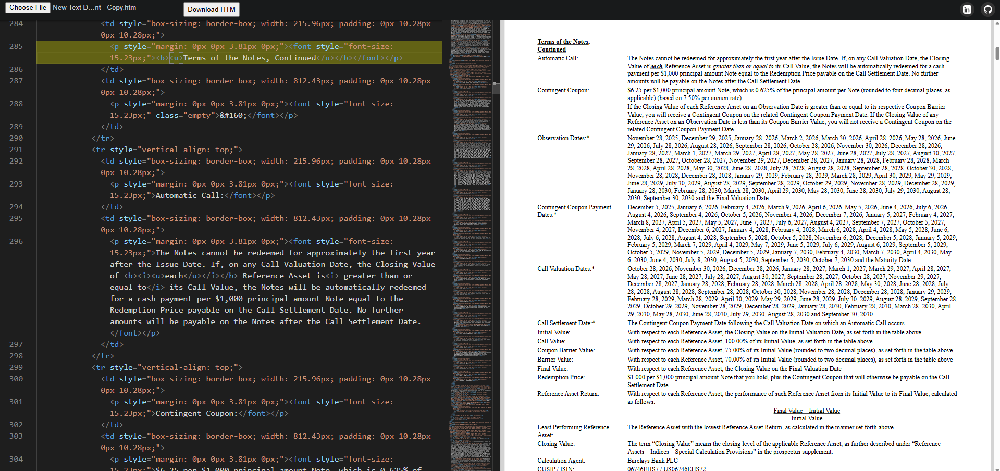

# HTML Live Editor with Monaco Editor

A **live HTML editor** with file upload, download, and live preview, built using [Monaco Editor](https://microsoft.github.io/monaco-editor/). This project allows you to write, edit, and preview HTML code in real-time, with added features like click-to-navigate between preview and editor.

---

## Author

**Imamul Kadir**

- [LinkedIn](https://www.linkedin.com/in/imamulkadir)
- [GitHub](https://github.com/imamulkadir)

---

## Features

- Live HTML editing with **Monaco Editor**.
- **Two-pane view**:
  - Left: HTML code editor
  - Right: Live output preview (scaled down for full visibility)
- **File upload**: Open and edit `.html` or `.htm` files directly.
- **Download functionality**: Save your code as `.htm`.
- **Click-to-navigate**: Click on any element in the preview to jump to the corresponding line in the editor.
- **Line highlighting**: Highlights the current line in the editor.
- Fully **responsive** design.
- Dark theme with Monaco Editor’s `vs-dark` theme.
- Smooth scrolling and scaling for large content.

---

## Demo Preview

---

## Installation

Open `index.html` in your browser. No additional backend is required.

---

## Usage

### Editing HTML

Type your HTML code in the left editor pane. The live preview updates automatically (debounced 300ms).

### Uploading a File

Click the **Choose File** button to select a `.htm` or `.html` file. The content will load into the editor.

### Downloading HTML

Click the **Download HTM** button to save the current editor content as `form424b2.htm`.

### Preview Interactions

Clicking on any element in the preview pane will scroll the editor to the corresponding line of code.

---

## Contributing

Contributions are welcome!

- Fork the repository
- Create a new branch
- Submit a pull request with improvements

---

## License

This project is **MIT licensed**.

---

## Contact

**Imamul Kadir**

- LinkedIn: [https://www.linkedin.com/in/imamulkadir](https://www.linkedin.com/in/imamulkadir)
- GitHub: [https://github.com/imamulkadir](https://github.com/imamulkadir)
